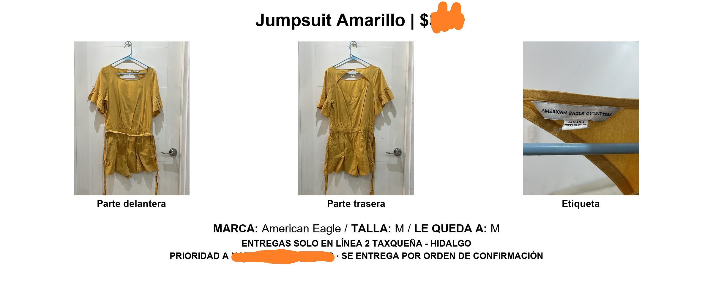

# White Door Closet: Automation of Closet Cleanup Resales

Automation pipeline for closet cleanup resales, photo auditing, inventory tracking, and Facebook Marketplace collage generation.

---

## 📌 Purpose

This project automates the workflow of organizing and posting second-hand clothing items for resale.

The pipeline was designed to reduce the manual work involved in:

- Organizing clothing inventory
- Processing item photos
- Auditing missing images
- Creating standardized Facebook Marketplace collages
- Reviewing generated collages visually before posting

The workflow is optimized for local resale logistics in Mexico City and Facebook group posting.

---

## ⚙️ Pipeline Overview

The pipeline currently performs the following tasks:

1. Converts raw item photos into standardized JPG files
2. Tracks photo metadata in an inventory workbook
3. Audits missing or inconsistent photos
4. Generates resale-ready collage images
5. Stores collages automatically by category
6. Creates an HTML gallery to visually inspect generated collages

---

## 🖼️ Example Collage

Example output generated automatically by the pipeline:



---

## 📂 Repository Structure

```text
white-door-closet/
│
├── examples/
│   └── item_0006_collage.jpg
│
├── scripts/
│   ├── convert_and_archive.py
│   ├── make_photo_audit.py
│   └── make_collages.py
│
├── README.md
├── requirements.txt
└── .gitignore
```

---

## 🧩 Main Scripts

### `convert_and_archive.py`

Processes raw item photos and standardizes them into JPG format while preserving metadata and naming conventions.

### `make_photo_audit.py`

Audits the inventory and photo archive to identify:

- Missing front photos
- Missing tag photos
- Missing JPG files
- Mixed image orientations
- Inventory items without photos

Also generates an HTML audit gallery.

### `make_collages.py`

Creates resale-ready collage images automatically using:

- Front / back / tag photos
- Item description
- Price
- Brand
- Size information

The script also generates a filterable HTML gallery for visual inspection before posting.

---

## 🛒 Marketplace Workflow

The generated collages are designed for Facebook Marketplace and resale groups.

Current formatting includes:

- White background
- Standardized typography
- Delivery notes
- Category-based organization
- Mobile-friendly visual layout

---

## 📦 Current Features

- Inventory integration via Excel
- Automatic collage generation
- Category folder organization
- Optional tag-photo handling (`NOTAG_REQUIRED`)
- HTML gallery with category filtering
- Automated photo auditing

---

## 🚧 Planned Improvements

Potential future improvements include:

- Automatic Facebook post text generation
- Batch upload helpers
- Automatic price summaries by category
- Duplicate item detection
- QR labels / inventory stickers
- Posting analytics

---

## 🔒 Privacy Note

The repository does not include:

- Personal inventory spreadsheets
- Raw photos
- Generated collages
- Buyer information
- Marketplace URLs

These files are intentionally excluded via `.gitignore`.

---

## 📋 Requirements

Install dependencies with:

```bash
pip install -r requirements.txt
```

---

## 👤 Author

Andrea González
